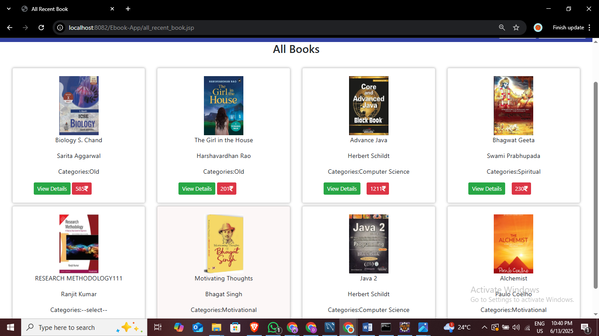
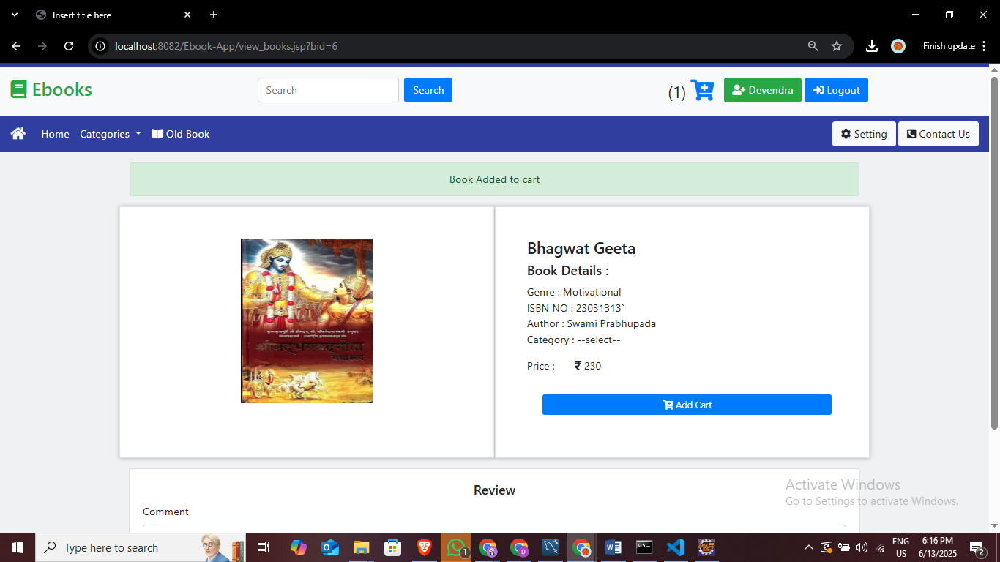
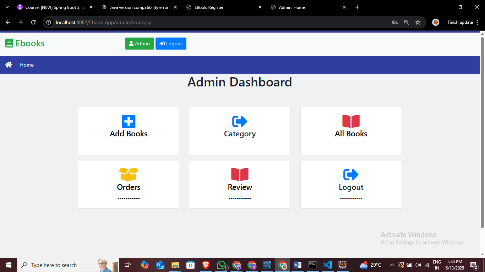
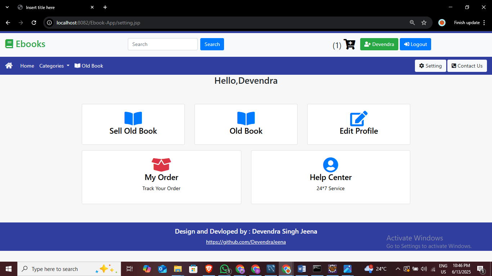
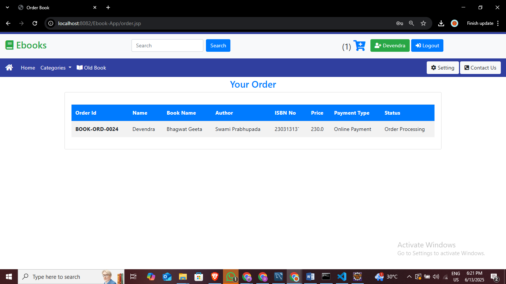
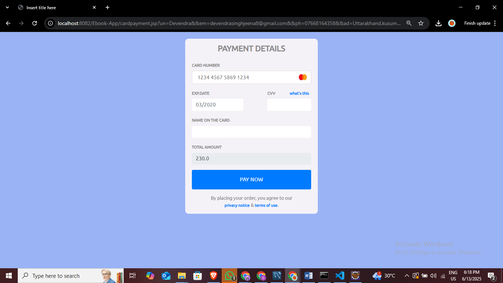

# 📚 **EBOOK STORE**

A full-stack **Ebook Store Web Application** built using **JSP**, **Servlets**, **JDBC**, and **MySQL**.
Users can **register, log in, browse, buy new books**, and even **sell old books**.
The platform supports both **Card Payment** and **Cash on Delivery (COD)**.

---

## 🛠 TECH STACK

* 🎨 **Frontend**: HTML, CSS, JSP
* 🧠 **Backend**: Java Servlets (MVC Architecture)
* 💽 **Database**: MySQL
* 🌐 **Server**: Apache Tomcat (v9+)
* 🧰 **IDE**: Eclipse or IntelliJ

---

## ✨ FEATURES

### 👤 USER MODULE

* 🔐 User Registration & Login
* 📚 Browse books by categories
* 🛒 Add books to Cart
* 💳 Checkout with Card or COD
* 👤 View Profile and Purchase History
* 🔁 **Sell Old Books** — List used books for others to buy

### 🛠 ADMIN MODULE

* ➕ Add New Books
* ✏️ Edit or 🗑️ Delete Books
* 📂 Manage Book Categories
* 📦 View Orders and Sales Summary *(optional)*

---

## 📁 PROJECT STRUCTURE

```
Ebook-Store/
├── src/
│   ├── admin/                  → Admin Servlets
│   ├── user/                   → User Servlets
│   ├── dao/                    → Data Access Objects
│   ├── db/                     → DB Connection Utility
│   └── entity/                 → POJO Classes (JavaBeans)
│
├── webapp/
│   ├── *.jsp                   → JSP Pages (User-facing)
│   ├── admin/                  → Admin Pages
│   ├── css/                    → Stylesheets
│
├── sql/
│   └── ebookstore_schema.sql   → Database Script
│
└── README.md
```


## 🖼 PREVIEW

Here are some screenshots of the project in action:

### 🏠 Home Page


### 📚 Book Listing Page


### 🛒 Cart Page


### 👤 Admin Profile



### 👤 User Profile



### 📦 Sell Old Book Page


### 📦 Payment Page



---

## 🙌 AUTHOR

Made with 💙 by **Devendra Singh Jeena**
🔗 [GitHub Profile](https://github.com/DevendraJeena)

---
